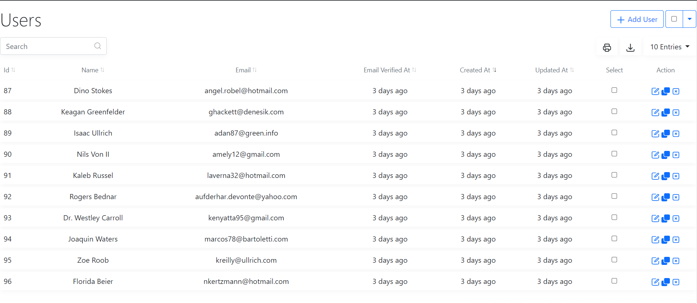
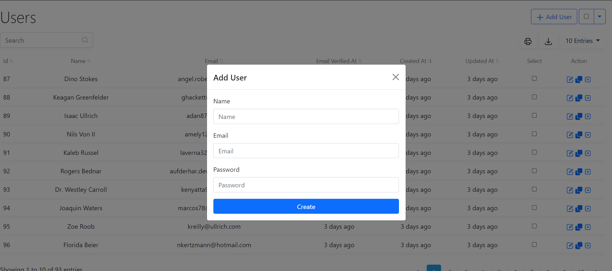
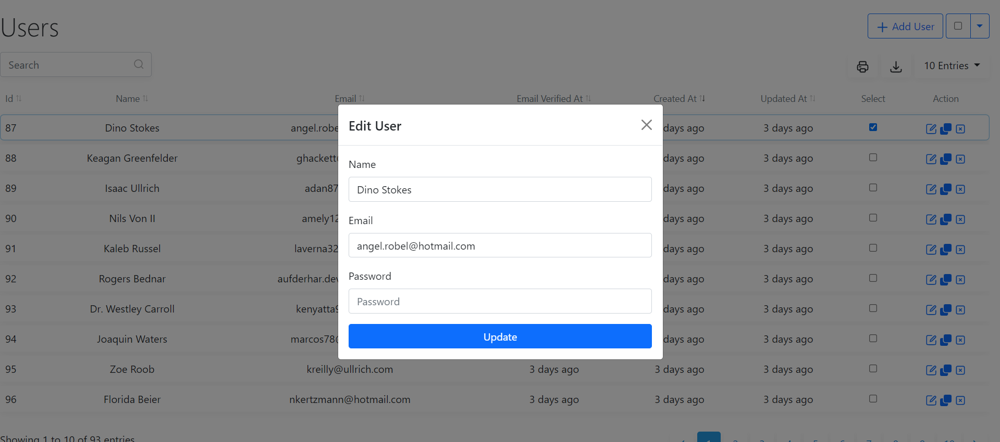
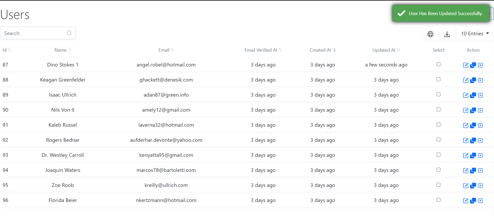
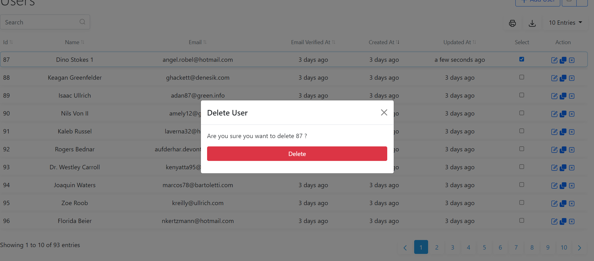

## datatable-cruds

[](https://www.paypal.com/paypalme/404Exist) [](https://packagist.org/packages/exist404/datatable-cruds) [](https://packagist.org/packages/exist404/datatable-cruds) [](https://github.com/404Exist/datatable-cruds/issues) [](https://packagist.org/packages/exist404/datatable-cruds)

## Installation
This package was created to deal with laravel datatables and cruds using vuejs.
Install the package through [Composer](http://getcomposer.org/). 

Run the Composer require command from the Terminal:

    composer require exist404/datatable-cruds
    

After completing the step above, use the following command to publish config file:

	php artisan datatablecruds:install

Now you're ready to start using datatable cruds in your application.
****
## Create DatatableCruds Class For Model Command
```bash 
php artisan datatablecruds:for User
```

## Overview
* [Usage 1](#usage-1)
* [Usage 2](#usage-2)
* [General Methods](#general-methods)
* [Common Methods](#columns-and-inputs-common-methods)
* [Columns Methods](#columns-methods)
* [Inputs Methods](#inputs-methods)
****

## Usage 1
```php
<?php

namespace App\Http\Controllers;

use App\Http\Controllers\Controller;
use App\Models\User;
use Illuminate\Http\Request;

class UserController extends Controller
{
    public function index()
    {
        return datatableCruds()
            ->for(User::class)
            ->with("profile")
            ->column("id")->sortable()->setAttribute("class", "test")
            ->columns($this->columns())
            ->inputs($this->inputs())
            ->cloneAction(false)
            ->render();
    }

    protected function columns()
    {
        return datatableCruds()
            ->column("name.en")->href(route('users.show', '|id|'))->label("Name")->searchable()
            ->column("profile.name.en")->sortable()->searchable()->exportable()
            ->column("created_at")->date()->exportable()
            ->column("updated_at")->date("DD/MM/YYYY")->sortable()
            ->column("actions")->actions();
    }

    protected function inputs()
    {
        return datatableCruds()
            ->input("name")->type("text")
            ->input("email")->type("email")
            ->input("password")->type("password");
    }

    public function store(Request $request)
    {
        User::create($request->all());
        return [
            'toast-message' => 'New User Has Been Added Successfully.',
            'toast-type' => 'success',
        ];
    }

    public function update(Request $request, $id)
    {
        User::where($request->findBy, $id)->first()->update($request->all());
        return [
            'toast-message' => 'User Has Been Updated Successfully.',
            'toast-type' => 'success',
        ];
    }

    public function destroy(Request $request, $id)
    {
        User::whereIn($request->findBy, explode(',', $id))->delete();
        return [
            'toast-message' => 'User Has Been Deleted Successfully.',
            'toast-type' => 'success',
        ];
    }
}

```
## Usage 2
#### render multiple datatables
```php
<?php

namespace App\Http\Controllers;

use App\Http\Controllers\Controller;
use App\Models\Product;
use App\Models\User;

class UserController extends Controller
{
    public function index()
    {
        $usersDatatable = datatableCruds()->setPageTitle("Users")
            ->setGetRoute(route('getUsers'))
            ->with("profile")
            ->column("id")->sortable()
            ->column("profile.name.en")->sortable()
            ->renderData();

        $productsDatatable = datatableCruds()->setPageTitle("Products")
            ->setGetRoute(route('getProducts'))
            ->column("id")->sortable()->setAttribute("class", "test")
            ->column("name.en")->label("Name")->searchable()
            ->renderData();
        
        return view("app", compact("usersDatatable", "productsDatatable"))
    }

    public function getUsers()
    {
        return dataTableOf(User::class);
    }

    public function getProducts()
    {
        return dataTableOf(Product::where('quantity', '>', 0));
    }

}
```
#### in app.blade.php use @datatable directive
```html
<!DOCTYPE html>
<html>
    <head>
        <meta charset="utf-8">
        <meta name="viewport" content="width=device-width, initial-scale=1, maximum-scale=1, viewport-fit=cover, shrink-to-fit=no">
        <meta name="csrf-token" content="{{ csrf_token() }}">
        <meta http-equiv="X-UA-Compatible" content="IE=edge">
        <meta name="theme-color" content="#100DD1">
        <meta name="apple-mobile-web-app-capable" content="yes">
        <meta name="apple-mobile-web-app-status-bar-style" content="black">
    </head>
    <body>
        @datatable($usersDatatable)
        @datatable($productsDatatable)
    </body>
</html>
```
## General Methods
### for()

Use the `for()` method at first it will define the model to get data from, it will specify the page title also by model table name.
this method accepts `Model::query()` or `Model::class`
```php
datatableCruds()->for(User::class);
// datatableCruds()->for(User::where("active", 1));
```
### setPageTitle()

use it to set a custom title for the page.


```php
$datatable->setPageTitle("DataTables");
```
### setDir()

use it to set a custom direction for the page default is `"ltr"`.

```php
$datatable->setDir("rtl");
```
### setHeader()

use it to set a custom header with all requests, you can call it for every header you need to set.
the first parameter is for header name and the second one is for the header value.
**you can write javascript code in the second parameter**

```php
$datatable->setHeader('X-CUSTOM-HEADER', '`Bearer ${localStorage.getItem("token")}`');
```
### with()

when you need to call column or input from table relation you must use this method to get the relation data.
this method accepts list of `string` parameters.

```php
$datatable->with('relation1', 'relation2:column1,column2', ...);
```
### searchBy()

use it to set the columns to search by. or you can just use `searchable()` method while rendering the column, we will explain it recently.
this method accepts list of `string` parameters.

```php
$datatable->searchBy('id', 'name->en', ...);
```
### exportCsvBtn()

you can use this method to remove export csv button or to set your own button.

```php
$datatable->exportCsvBtn("<a href='/csv?page=|current_page|&limit=|per_page|'>Csv</a>");
```
### exportExcelBtn()

you can use this method to remove export excel button or to set your own button.

```php
$datatable->exportExcelBtn(false);
$datatable->exportExcelBtn(true, "exportedFileName");
```
### printBtn()

you can use this method to remove export print button or to set your own button.

```php
$datatable->printBtn(false);
```
### Routes
**by default you don't need to set any routes, the default routes will be as in the following table.**
| Route             | Method |
| ------------------| -------|
| CURRENT_URL       | GET    |
| CURRENT_URL       | POST   |
| CURRENT_URL/\|id\|  | PATCH  |
| CURRENT_URL/\|id\|  | DELETE |
### setGetRoute()
use it to set a custom route to get data from.
in the route controller method you can just return this helper function and pass your model to it `dataTableOf(User::class)`.

```php
$datatable->setGetRoute('/custom-route');
```
### setStoreRoute()
use it to set a route to send form store data to it. the first parameter is for the route and the second for the route method, by default its `POST`.

```php
$datatable->setStoreRoute('/store-route');
```
### setUpdateRoute()
use it to set a route to send form update data to it.
the first parameter is for the route , and the second for the route method, by default it's `PATCH`.
**route parameters must be written between two columns || and these parameters will be replaced with the value from the row we are modifying**
Also with the request you will get a request key called `findBy` whose value in this case will be `id` and you can change the `findBy` request key name with this method `setRequestFindByKeyName("newFindByKey")`.

```php
$datatable->setUpdateRoute(route('update-route', '|id|'));
```
### setDeleteRoute()
use it to set a route to send form delete data to it.
the first parameter is for the route , and the second for the route method, by default it's `DELETE`.
**route parameters must be written between two columns || and these parameters will be replaced with the value from the row we are deleting**
you will also get the request key `findBy` with the request as in the above example.

```php
$datatable->setDeleteRoute(route('delete-route', '|id|'));
```
### setDefaultDateFormat()

use it to set columns default date format. 
by default it's human format.

```php
$datatable->setDefaultDateFormat("YYYY-MM-DD");
```
### setDefaultOrder()

use it to set the default get data order.
by default its `("created_at", "desc")`.

```php
$datatable->setDefaultOrder("created_at", "desc");
```
### addAction() && editAction() && deleteAction() && cloneAction()

**all of these methods works in the same way.**
**if you want to disable any button of these buttons just pass false to method**
use it to set custom add button.
the first parameter of the method is button html,
the second one is button action you can set it to one of these choices `("openModal", "funcName", "href")` default is `"openModal"` 
and the third parameter is for action value if you set the button action to `"href"` you will need to pass href value in the third parameter 
and if you set the button action to `"funcName"` you will need to pass a javascript function name to execute onClick on the add button.
**by default add button will open modal for form store.**
if you send `funcName`, when you create this function in your app you will get two parameters in it `(event, row)` row which will contain the row data but in method `addAction()` you will only get the event `(event)`.

```php
$datatable->addAction('<button class="btn btn-primary"> Add New User </button>');
```
### search()

use it to set the search debounce time.
the first parameter of the method is the debounce time and the second one is for the class name of the search input, by default it is `"form-control"`.

```php
$datatable->search('500ms');
```
### setText()

use it to update any text.
the first parameter is for the text key and the second one is for its value.
you will find all available text keys at `config/datatablecruds.php`

```php
$datatable->setText("delete.title", "Delete");
$datatable->setText("info", "Showing |from| to |to| of |total| entries");
```
### setLimits()

use it to set select limit entries options.
this method accepts list of `int` parameters.
```php
$datatable->setLimits(10, 20, 30, 40, ...);
```
### formWidth()

use it to set custom width to form.

```php
$datatable->formWidth("40%");
```
### formHeight()

use it to set custom height to form.

```php
$datatable->formHeight("200px");
```
### storeButton()
use it to set custom label and color to form store button.
by default the label is `"Create"` and the color is `"primary"` 

```php
$datatable->storeButton("Create", "primary");
```
### updateButton()
use it to set custom label and color to form update button.
by default the label is `"Update"` and the color is `"primary"` 

```php
$datatable->updateButton("Update", "primary");
```
### deleteButton()
use it to set custom label and color to form delete button.
by default the label is `"Delete"` and the color is `"danger"` 

```php
$datatable->deleteButton("Delete", "danger");
```
### setBladeExtends()
use this method to set `@extends` to add datatable in your blade layout.
**you can set the default `@extends` from datatablecruds config file**
```php
$datatable->setBladeExtends("app");
```
### setBladeSection()
use this method to set `@section` name that will go to `@yield` in the blade layout.
**you can set the default `@section` from datatablecruds config file**
```php
$datatable->setBladeSection("content");
```
### showPagination()
this method accepts one boolean prameter, by default it's true.
```php
$datatable->showPagination(false);
```
### hidePaginationIfContainOnePage()
this method accepts one boolean prameter, by default it's true.
```php
$datatable->hidePaginationIfContainOnePage(false);
```
### renderData()
This method will return an array and you can use it with `@datatable` directive to render datatable cruds.
**if you want to render one datatable only it's better for you to use render method instead of this**

```php
$datatable = $datatable->renderData();
return view('app', compact('datatable'));
// in app.blade.php file render this directive
@datatable($datatable)
```
### render()
Finally, use this method to render your datatable view.
this method accepts one prameter which is an array of variables that can be accessed in the `@extends` (layout) blade file.

```php
$datatable->render(["title" => "datatable"]);
```
***

# Columns and Inputs Common Methods
### label()

You can use this method to set custom label for the column or input by default the label will be set from column or input name.
```php
$datatable->column("created_at")->label("Created Date")->date();
$datatable->input("name")->label("User Name");
```
### html()
you can use this method to set custom column or input html.
```php
$datatable->column("image")->html("Img: ");
$datatable->input("hr")->html("<hr />");
```
### attributes()

you can use this method to set custom html tag attributes to the column or the input.
```php
$datatable->column("id")->attributes([
    "class" => "btn btn-danger",
    "style" => "font-size: 20px"
]);
$datatable->input("name")->attributes([
    "class" => "form-control",
    "style" => "font-size: 20px"
]);
```
### setAttribute()

you can use this method to set custom html tag attribute to the column or the input.
```php
$datatable->column("id")->setAttribute("class", "btn btn-danger")->setAttribute("style", "font-size: 20px");
$datatable->input("name")->setAttribute("class", "form-control")->setAttribute("style", "font-size: 20px");
```

# Columns Methods

### column()

You can use this method to start creating a new column.
you can pass db_column_name or whatever name you need to the column method, if you pass the db_column_name it will return the data of that column, you can also access the nested data using `.` for example `column("name.en")`
```php
$datatable->column("updated_at")->sortable()->searchable()->date("YYYY-MM-DD");
// render column if condition true
$datatable->column(function() {
    if (true) {
        return "status";
    }
});
```

### setColumns() 

use this magic method to display columns to the view, you can use any column method in this method.
this method accepts list of `string` parameters.
##### how to write each parameter in this method ?
* parameter text must begin with the column name.
* you can implement any of the column methods using this symbol `|` and then type the method name `"email|sortable"`.
* how to pass parameters to the method ?
  * if you want to pass parameters just put the prameters in half circle brackets `()` for example `|multiSelect(name,id,true)` it's the same as `->multiSelect("name", "id", true)`.
  * If you want to pass an array as a parameter, you have to write that array in json format `{"class":"bg-danger p-2"}`.
* you can use these symbols `|$#` to write javascript code and set the value to column html or you can use these symbols `|$@` to write javascript code and set the value to column href.
```php
$datatable->setColumns(
    'id',
    'name|sortable|searchable|attributes({"class":"bg-danger p-2"})',
    'email|href(|id|)',
    'status|$#"{email_verified_at}" ? "<span>Verified</span>" : "<span>Not Verified</span>"',
    'created_at|date(YYYY-MM-DD)',
    'updated_at|date',
    'select|checkall',
    'actions|actions',
);
```
### sortable()
You can use this method to make column is sortable.
this method accepts one boolean parameter by default it's true.

```php
$datatable->column("updated_at")->sortable(false);
```
### searchable()
You can use this method to make column is searchable.
this method accepts one boolean parameter by default it's true.

```php
$datatable->column("updated_at")->searchable(false);
```
### exportable()
This method must be used to make the column visible while the page is being printed and in export files.
this method accepts one boolean parameter by default it's true.

```php
$datatable->column("name")->exportable();
```
### date()
You can use this method to make date columns more readable default is human format Optionally you can pass any format to date method or you can pass `false` to this method to remove any format from date.
```php
$datatable->column("date")->date("YYYY-MM-DD");
```
### image()
You can use this method to show column in html img tag.
the image src will be the value of the db_column.
you can pass any value to this method and that value will be applied before the value of the db_column or you can pass `false` to this method to remove the image element.

```php
$datatable->column("image")->image("images/|id|/");
```
### href()
**if you want to access any field value just write that field between two columns || `|created_at|`**
you can use this method to set href to the column.
```php
$datatable->column("image")->href("|id|/|category.name.en|");
```
### actions()
You can use this method to create clone, edit and delete actions buttons, and you can optionally pass the given column label to the method the default label will be set from the column name.

```php
$datatable->column("actions")->actions();
```
### checkall()
You can use this method to enable all rows to be selected for deletion at once, and you can optionally pass the given column label to the method the default label will be set from the column name.

```php
$datatable->column("select")->checkall();
```
### execHtml() && execHref()

you can use these methods to execute any `javascript code`, by default it will return the whole code , if you want to return specfic data you will need to write `return` before it.
**in these methods if field you are going to write between two columns || is not number then you must enclose it in double quotes `"|created_at|"`**
```php
$datatable->column("custom_one")->execHtml('|status| == 1 ? "<span class="badge bg-success"> Active </span>" : "<span class="badge bg-danger"> InActive </span>"');
$datatable->column("custom_one")->execHref('/|id|');
```

****

# Inputs Methods

### input()
You can use this method to start creating a new input.

```php
$datatable->input("name.en")->type("text");
// render input if condition true
$datatable->input(function() {
    if (true) {
        return "status";
    }
});
```
if you make input name like above example `"name.en"` then you can access it in store and update requests this way `$request->name->en`

### setInputs() 

use this magic method to display inputs to the forms, you can use any input method in this method.
this method accepts list of `string` parameters.
##### how to write each parameter in this method ?
* parameter text must begin with the input name `"email"`.
* you can implement any of the input methods using this symbol `|` and then type the method name `"the_tags|tags"`, you can also write the input type after this symbol `"email|email"`.
* how to pass parameters to the method ?
    * if you want to pass parameters just put the prameters in half circle brackets `()` for example `|multiSelect(name,id,true)` it's the same as `->multiSelect("name", "id", true)`.
    * If you want to pass an array as a parameter, you have to write that array in json format `[{"id":1, "name": "name1"}, {"id": 2, "name": "name2"}]`.
```php
$datatable->setInputs(
    'name|text', 'email|email', 'password|password',
    'images|dropzone({"multiple":true, "acceptedFiles":"mp4,png"})',
    'choices|multiSelect(name,id,false)|options([{"id":1, "name": "name1"}, {"id": 2, "name": "name2"}])',
);
```
### editForm()

You can use this method to add the input to the edit form only, by default it will be added in all forms. 
```php
$datatable->input("name.en")->editForm();
```
### createForm()

You can use this method to add the input to the create form only, by default it will be added in all forms. 
```php
$datatable->input("name.en")->createForm();
```
### page()

You can use this method to make the input added in the custom form page number.
```php
$datatable->input("name.en")->page(1);
```
### parentClass()

You can use this method to add class to the parent element.
```php
$datatable->input("name.en")->parentClass("col-md-3");
```
### labelClass()

You can use this method to add class to the label element.
```php
$datatable->input("name.en")->labelClass("mb-1");
```
### type()

use this method to set the input type.
```php
$datatable->input("name.en")->type("text");
```
### select()

you can use this method to make a `select` tag.
this method accepts two parameters the first one for options label column name by default its `name` and the second one is for options value column name by default its `id`.
```php
$datatable->input("select")->select("name.en")->options([
        ["id" => 1, "name" => ["en" => "datatable-1"]],
        ["id" => 2, "name" => ["en" => "datatable-2"]],
    ]);
```
### multiSelect()

you can use this method to make a `multi-select` input.
this method accepts three parameters the first one for options label column name by default its `name` , the second one is for options value column name by default its `id` and the last one is for multiple selection by default its `true`.
**in the edit form when multiSelect is multiple and you remove any selected options you will get the values of those options in the update request in request key starts with `remove_` then the input name.**
```php
$datatable->input("multi")->multiSelect("name.en")->options([
        ["id" => 1, "name" => ["en" => "datatable-1"]],
        ["id" => 2, "name" => ["en" => "datatable-2"]],
    ]);
```
if you want to get multiSelect options on search you can use `optionsRoute()` method. and you can use `$request->search` to access the search text.
```php
$datatable->input("multi")->multiSelect("name.en")->optionsRoute("/theRoute");
```
### onChange()

you can use this method to update select options on other select change.
this method accepts two parameters the first one for the select name to update and the second one is for the route to get options from it.
you can use `$request->value` to access the selected option value in the onChange route.

```php
$datatable->input("select1")->select("name.en", "val")->options([
        ["val" => 1, "name" => ["en" => "datatable-1"]],
        ["val" => 2, "name" => ["en" => "datatable-2"]],
    ])
    ->onChange('select2', '/select2');
$datatable->input("select2")->select("name.en");
```
### dropzone()

use this method to make drag and drop files input.
this method accepts dropzone attributes.
**in the edit form when dropzone is multiple and you delete any file from the dropzone you will get the values(ids) of those files in the update request in request key starts with `remove_` then the input name.**

```php
$datatable->input("image")->dropzone([
    // "idColumn" => "multiple_images.id", // the column name to set the values of the deleted images
    // "path" => "/images", // path to be set before the db image path
    "multiple" => true, // default is false
    "maxFiles" => 6,
    "maxFileSize" => 2 * 1024 * 1024, //2MB
    "acceptedFiles" => 'jpg,mp4',
    // "addDownloadinks" => true, // default is true
    // "addRemoveLinks" => true, // default is true
    // "addFileName" => true, // default is true
    // "addFileSize" => true, // default is true
    // "customeMaxFilesMsg" => 'You can\'t upload more than 6 files',
    // "customeMaxFileSizeMsg" => 'Sorry, but max file size must be 2MB',
    // "customeAcceptedFilesMsg" => 'Sorry, but allowed extensions are ',
    // "removeMessageAfter" => 5000, // time || false  default 2500 ms,
    // "notFoundFileCallBack" => "404.jpg",
    // "overLayMessage" => "Drop Here",
]);
```
### tags()

you can use this method to make a `tags` input.
```php
$datatable->input("name.en")->tags();
```
### checkbox()

you can use this method to make a checkbox,
This method accepts two parameters. The first is the checked value of the checkbox which is `true` by default and the second is the unchecked value of the checkbox which is `false` by default.
```php
$datatable->input("checkbox")->checkbox(1, 0);
```
### radio()

you can use this method to create radio buttons, this method accepts one parameter which will be the value of that radio button.
```php
$datatable->input("radio")->radio(1)->label("Choice 1");
$datatable->input("radio")->radio(2)->label("Choice 2");
$datatable->input("radio")->radio(3)->label("Choice 3");
```
****
[](https://packagist.org/packages/exist404/datatable-cruds)
[](https://packagist.org/packages/exist404/datatable-cruds)
[](https://packagist.org/packages/exist404/datatable-cruds)
[](https://packagist.org/packages/exist404/datatable-cruds)
[](https://packagist.org/packages/exist404/datatable-cruds)
****
